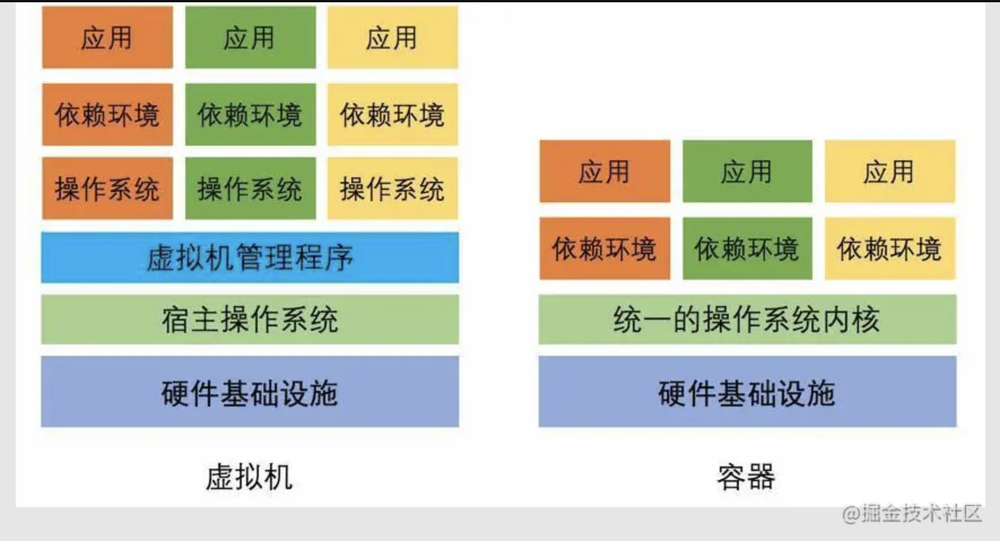
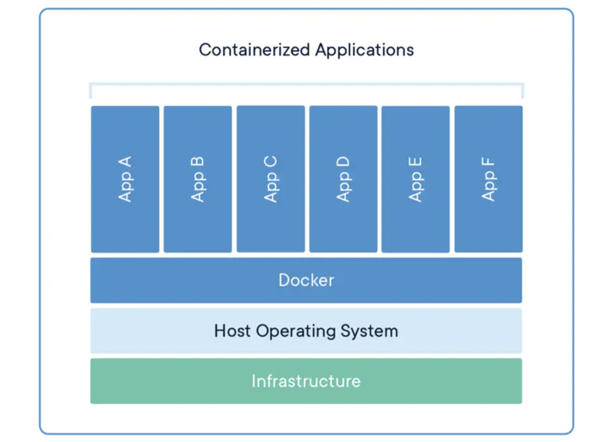

# 浅谈虚拟化和容器技术

## 虚拟化技术

- 为程序跨平台兼容而生
- 将虚拟化应用于资源管理

## 容器

容器技术提供了相对独立的应用程序运行的环境，也提供了资源控制的功能，所以我们可以将其归纳为一种实现不完全的虚拟技术。

由于没有了虚拟操作系统和虚拟机监视器这两个层次，大幅减少了应用程序运行带来的额外消耗。

更准确的来说，所有在容器中的应用程序其实完全运行在了宿主操作系统中，与其他真实运行在其中的应用程序在指令运行层面是完全没有任何区别的。

# 这就是 Docker 的简历

- 云计算时代的挑战
  各种依赖关系部署复杂，服务器多，可能还有兼容性问题，简直就是灾难
- 皆为效率
  Docker 的初衷就是效率问题。在容器的这个跑道上，他的全面性和易用性都可圈可点

## Docker 的技术实现
- 命名空间 Namespaces
  用于隔离
- 控制组 Control Groups
  控制计算机资源
- 联合文件系统 Union File System
  AUFS 像 git 一样存 diff 减少空间占用

## Docker 的理念

与其他虚拟化实现甚至其他容器引擎不同的是，Docker 推崇一种轻量级容器的结构，即一个应用一个容器。

Docker 的轻量级容器实现和虚拟机的一些参数对比
|属性|Docker|虚拟机|
|:--:|:--:|:--:|
|启动速度|秒级|分钟级|
|硬盘使用|MB 级|GB 级|
|性能|接近原生|较低|
|普通机器支撑量|数百个|几个|
