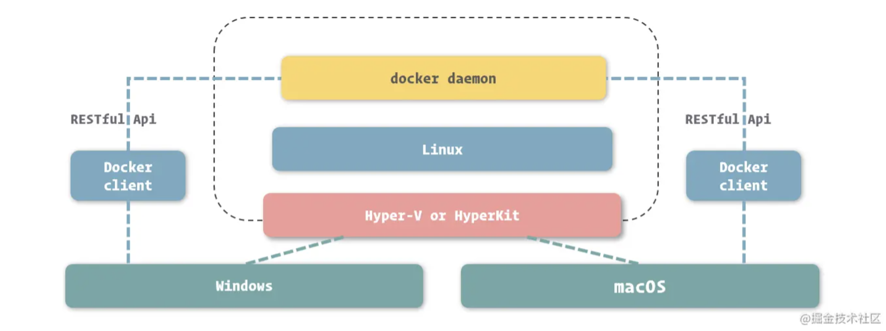

# 搭建 Docker 运行环境

## Docker 基础介绍

Docker 分为社区版和企业版。

Docker Engine 的版本号以日期命名，后面可能还会追加次要版本为修正版本，次要版本由主要版本和发布序号组成。

Docker Engine 的稳定版固定为没三个月更新一次。

## 在 Linux 上安装 Docker

因为我自己是 Mac 本，不考虑 Linux 安装，但是**看文章的意思**是 Docker 是安装到 Linux 上的(即使是 Windows 和 Mac 上, 也会想办法虚拟一个 Linux 出来)，也是依靠 Linux 来实现跨平台的。

## 设置国内镜像

https://registry.docker-cn.com

## 一些 Docker 命令

- docker version
- docker info
- ...

# 在 Windows 和 Mac 中使用 Docker

在 Windows/Mac 上使用 Docker Desktop 来使用 Docker, 因为他们的背后实现是操作系统虚拟一个 Linux 出来，所以对 Windos/Mac 的操作系统版本由要求。

可以通过配置实现：

- 文件系统挂载
- 资源控制
- 网络配置
- docker daemon 配置

如果操作系统版本不满足要求，有手动生成虚拟 Linux 的方案去解决操作系统版本过低的问题。

# 问题

- Docker 依赖 Linux 实现跨平台这个结论还有待确认