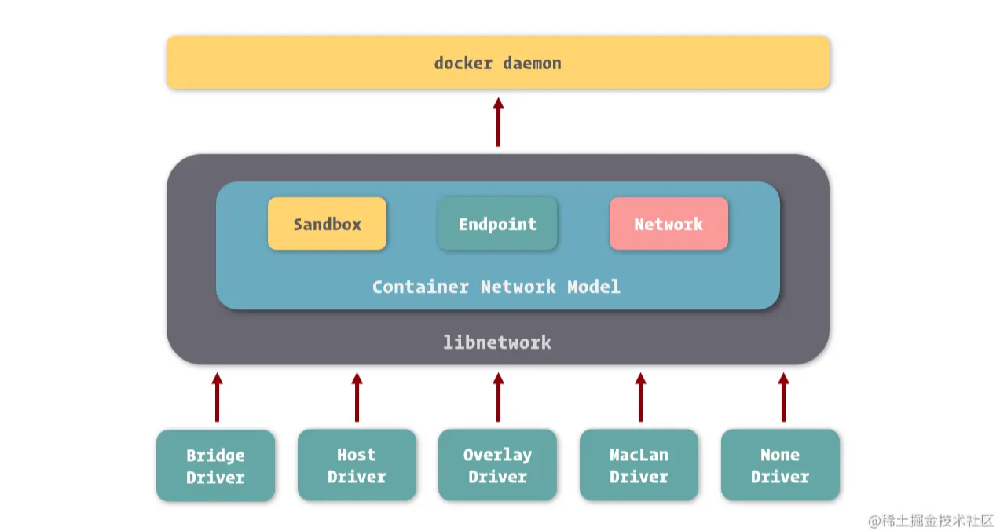
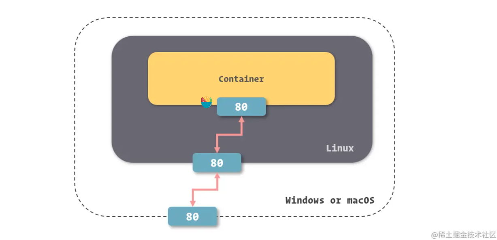
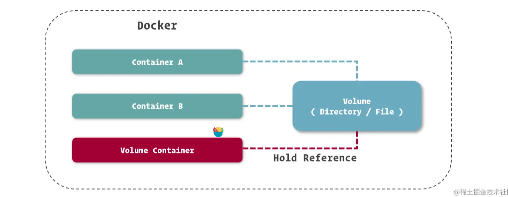

# 镜像与容器

如果进行形象的表述，我们可以将 Docker 镜像理解为包含应用程序以及其相关依赖的一个基础文件系统，在 Docker 容器启动的过程中，它以只读的方式被用于创建容器的运行环境。

从另一个角度看，在之前的小节里我们讲到了，Docker 镜像其实是由基于 UnionFS 文件系统的一组镜像层依次挂载而得，而每个镜像层包含的其实是对上一镜像层的修改，这些修改其实是发生在容器运行的过程中的。所以，我们也可以反过来理解，镜像是对容器运行环境进行持久化存储的结果。

镜像是由一堆镜像层构成的，镜像之间可以共享镜像层，实现 1 + 1 < 2 的效果。


## 镜像命名

镜像层的 ID 既可以识别每个镜像层，也可以用来直接识别镜像

镜像的明明可以分为三个部分
- username： 主要用于识别上传镜像的不同用户，与 GitHub 中的用户空间类似。
- repository：主要用于识别进行的内容，形成对镜像的表意描述。
- tag：主要用户表示镜像的版本，方便区分进行内容的不同细节

## 容器即应用

容器生命周期与应用生命周期的关系。

程序的主进程记为应用的主进程。

## 写时复制

## 命令

- docker images: 查看镜像

# 从镜像仓库获得镜像

## Docker Hub

https://hub.docker.com/

可以搜索镜像

## 命令参数识别

能识别出来即可，无需使用全部的 id

## 命令
- docker pull [IMAGE_NAME]: 获取镜像
  ```sh
  # 默认 tag 是 latest
  docker pull ubuntu
  # 完整的镜像名
  docker pull openresty/openresty:1.13.6.2-alpine
  ```
- docker search [IMAGE_NAME]: 搜索镜像
  ```sh
  docker search ubuntu
  ```
- docker inspect [IMAGE_NAME]: 查看镜像详细信息
  ```sh
  # 使用 name inspect
  docker inspect redis:3.2
  # 使用 id inspect
  docker inspect 2fef532e
  ```
- docker rmi [IMAGE_NAME]: 删除镜像
  ```sh
  docker rmi ubuntu:latest
  # 删除多个镜像
  docker rmi redis:3.2 redis:4.0
  ```

# 运行和管理容器


容器有5个状态:
- created
- Running
- Paused
- Stopped
- Deleted

## 命令
- docker create: 创建容器
  ```sh
  docker create nginx:1.12
  # 指定容器名
  docker create --name nginx nginx:1.12
  ```
- docker start [CONTAINER_NAME]: 启动容器
  ```sh
  docker start nginx
  ```
- docker run: docker create + docker start
  ```sh
  # -d/--detach: 后台运行
  docker run --name nginx -d nginx:1.12
  ```
- docker ps: 查看容器
  ```sh
  # 默认值列出 Running 的容器
  docker ps
  # -a/--all 列出所有容器
  docker ps -a
  ```
- docker stop: 停止正在运行的容器
  ```sh
  docker stop nginx
  ```
- docker rm: 删除容器
  ```sh
  docker rm nginx
  # 正在运行的容器默认不可删除，需要使用 -f/--force 强制删除
  docker rm -f nginx
  ```
- docker exec: 进入容器
  ```sh
  docker exec nginx more /etc/hostname
  docker exec -it nginx bash
  ```
- docker attach: 衔接容器
  ```sh
  # 前台的意思
  # 使用不多
  docker attach nginx
  ```
- docker volume create: 创建数据卷
  ```sh
  # 创建和容器无关的数据卷
  docker volume create appdata
  ```
- docker volume ls: 查看数据卷
  ```sh
  docker volume ls
  ```
- docker volume rm: 删除数据卷
  ```sh
  docker volume rm appdata
  ```
- docker volume prune: 删除没有被容器引用的数据卷
  ```sh
  docker volume prune -f
  ```

# 为容器配置网络

## 容器网络

三个核心概念:

- 沙盒 Sandbox
- 网络 Network
- 端点 Endpoint

## 浅谈 Docker 网络实现



五种 Docker 网络驱动：
- Bridge Driver
- Host Driver
- Overlay Driver
- MacLan Driver
- None Driver

Bridge 网络是 Docker 容器的默认网络驱动。

Bridge Driver 和 Overlay Driver 在开发中使用频率较高。

## 容器互联

互联的前提是在一个网络下

- --link(docker create/run 的时候使用该选项)
  ```sh
  docker run -d --name mysql -e MYSQL_RANDOM_ROOT_PASSWORD=yes mysql
  docker run -d --name webapp --link mysql webapp:latest
  ```
- 在容器中如何连接另外一个容器
  ```java
  String url = "jdbc:mysql://mysql:3306/webapp";
  ```
## 暴露端口

--expose

```sh
docker run -d --name mysql -e MYSQL_RANDOM_ROOT_PASSWORD=yes --expose 13306 --expose 23306 mysql:5.7
```

可以在 docker ps 中查看

## 通过别名连接

```sh
docker run -d --name webapp --link mysql:database webapp:latest
```

```java
String url = "jdbc:mysql://database:3306/webapp";
```

## 在 windows/Mac 中使用映射
无需手动操作


使用 toolBox 的话需要手动操作

## 命令
- --link
- --expose
- docker inspect: 查看容器
- docker network create: 创建网络
  ```sh
  # -d 指定 driver 类型，不指定的话默认 bridge
  docker network create -d bridge individual
  ```
- docker network ls: 查看已经存在的网络
  ```sh
  docker network ls
  docker network list
  ```
- --network: 可以创建容器的时候使用 --network 指定网络
  ```sh
  docker run -d --name webapp --link mysql --network individual webapp:latest
  ```
- -p 端口映射
  ```sh
  docker run -d --name nginx -p 80:80 -p 443:443 nginx:1.12
  ```

# 管理和存储数据

挂载方式
- Bind Mount: 存储在宿主机文件系统中，双向的
- Volume: 数据卷
- Tmpfs Mount: 在内存中，临时存储

## 数据卷容器



```sh
# 创建一个数据卷容器
docker create --name appdata -v /webapp/storage ubuntu
# 创建容器使用 appdata 这个数据卷容器
docker run -d --name webapp --volumes-from appdata webapp:latest
```

备份和迁移数据卷

```sh
# 备份
docker run --rm --volumes-from appdata -v /backup:/backup ubuntu tar cvf /backup/backup.tar /webapp/storage
# 恢复
docker run --rm --volumes-from appdata -v /backup:/backup ubuntu tar xvf /backup/backup.tar -C /webapp/storage --strip
```
## 命令

- -v/--volume
  ```sh
  # bind mount
  docker run -d --name nginx -v /webapp/html:/usr/share/nginx/html nginx:1.12
  # bind mount
  # 容器只读
  docker run -d --name nginx -v /webapp/html:/usr/share/nginx/html:ro nginx:1.12

  # volume
  # 会生成一个 id 作为 name
  docker run -d --name webapp -v /webapp/storage webapp:latest
  # volume
  # 指定数据卷 name
  docker run -d --name webapp -v appdata:/webapp/storage webapp:latest
  # 下面两个命令共用数据卷 html
  docker run -d --name webapp -v html:/webapp/html webapp:latest
  docker run -d --name nginx -v html:/usr/share/nginx/html:ro nginx:1.12

  # 删除容器时删除关联的数据卷
  docker rm -v webapp
  ```
- --tmpfs
  ```sh
  # tmpfs mount
  docker run -d --name webapp --tmpfs /webapp/cache webapp:latest
  ```
- --rm
- --volumes-from
- 启动时后面跟命令