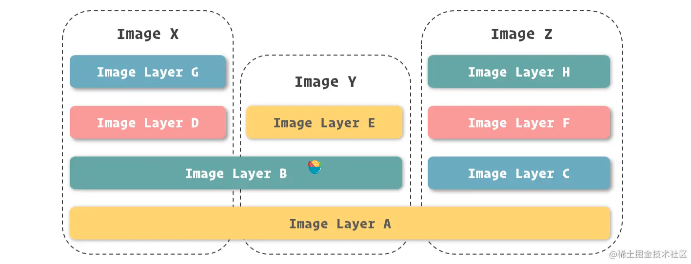

# 使用容器：镜像与容器

如果进行形象的表述，我们可以将 Docker 镜像理解为包含应用程序以及其相关依赖的一个基础文件系统，在 Docker 容器启动的过程中，它以只读的方式被用于创建容器的运行环境。

从另一个角度看，在之前的小节里我们讲到了，Docker 镜像其实是由基于 UnionFS 文件系统的一组镜像层依次挂载而得，而每个镜像层包含的其实是对上一镜像层的修改，这些修改其实是发生在容器运行的过程中的。所以，我们也可以反过来理解，镜像是对容器运行环境进行持久化存储的结果。

镜像是由一堆镜像层构成的，镜像之间可以共享镜像层，实现 1 + 1 < 2 的效果。

## 镜像命名

镜像层的 ID 既可以识别每个镜像层，也可以用来直接识别镜像

镜像的明明可以分为三个部分
- username： 主要用于识别上传镜像的不同用户，与 GitHub 中的用户空间类似。
- repository：主要用于识别进行的内容，形成对镜像的表意描述。
- tag：主要用户表示镜像的版本，方便区分进行内容的不同细节

## 容器即应用

容器生命周期与应用生命周期的关系。

程序的主进程记为应用的主进程。

## 写时复制

## 命令

- docker images: 查看镜像