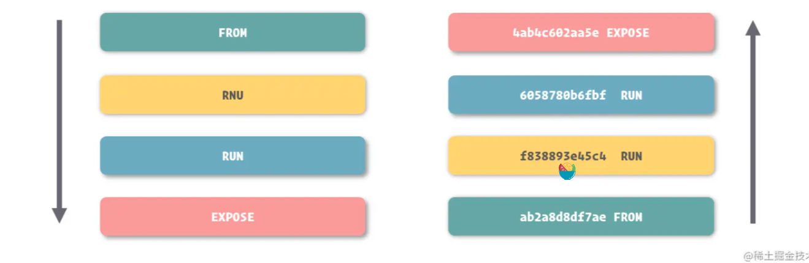

# 保存和共享镜像

## 命令
- docker commit: 将容器修改的内容保存为镜像
  ```sh
  # 会输出一个镜像 id. repository 和 tag 都为 <none>
  docker commit webapp
  # 可以添加提交信息
  docker commit -m "Configured" webapp
  # 命名
  docker commit -m "Upgrade" webapp webapp：2.0
  ```
- docker tag: 为镜像命名
  ```sh
  # 指定一个 image id 为其命名
  docker tag 0bc42f7ff218 webapp:1.0
  # 为已有的一个镜像重新命名
  # 在 docker images 里面这两个会都存在
  docker tag webapp:1.0 webapp:latest
  ```
- 镜像迁移
  + docker save/load
    ```sh
    # 输入输出流的方式
    docker save webapp:1.0 > webapp-1.0.tar
    docker load < webapp-1.0.tar

    # 指定输入输出文件的方式
    docker save -o ./webapp-1.0.tar webapp:1.0
    docker load -i webapp-1.0.tar

    # 可以批量迁移
    docker save -o ./images.tar webapp:1.0 nginx:1.12 mysql:5.7
    ```
  + docker export/import: 导出和导入容器
    ```sh
    # 可以理解成 docker export 是 docker commit 和 docker save 的结合版
    docker export -o ./webapp.tar webapp
    # 导入不是直接将容器导入，而是将容器运行时的内容以镜像的形式导入
    docker import ./webapp.tar webapp:1.0
    ```
# 通过 Dockerfile 创建镜像

常见的 Dockerfile 指令:

- FROM
  ```txt
  FROM <image> [AS <name>]
  FROM <image>[:<tag>] [AS <name>]
  FROM <image>[@<digest>] [AS <name>]
  ```
- RUN
  ```txt
  RUN <command>
  RUN ["executable", "param1", "param2"]
  ```
- 启动命令 ENTRYPOINT/CMD
  ```txt
  ENTRYPOINT ["executable", "param1", "param2"]
  ENTRYPOINT command param1 param2

  CMD ["executable","param1","param2"]
  CMD ["param1","param2"]
  CMD command param1 param2
  ```
- EXPOSE 暴露端口
  ```txt
  EXPOSE <port> [<port>/<protocol>...]
  ```
- VOLUME 数据卷
  ```txt
  VOLUME ["/data"]
  ```
- COPY 和 ADD
  ```txt
  COPY [--chown=<user>:<group>] <src>... <dest>
  ADD [--chown=<user>:<group>] <src>... <dest>

  COPY [--chown=<user>:<group>] ["<src>",... "<dest>"]
  ADD [--chown=<user>:<group>] ["<src>",... "<dest>"]
  ```
## 命令
docker build 构建镜像
```sh
# 基于 webapp 目录构建
docker build ./webapp
# 指定 Dockerfile path 和 镜像名称
docker build -t webapp:latest -f ./webapp/a.Dockerfile ./webapp
# 指定镜像名称
docker build -t webapp:latest ./webapp
```
# 常见的 Dockerfile 使用技巧

## 构建中使用变量
- ARG: 参数
  在 Dockerfile 里面定义，使用 `$ARG_NAME` 引用，在 docker build 的时候可以通过 --build-arg传递对应参数进去
- ENV 环境变量
  在 Dockerfile 使用环境变量指定值，在调用 docker 命令的时候可以使用 -e/--env 来修改默认值
## 合并命令

在 Docker 中一个长语句可以拆分成多条短命令来写，但是这样会导致镜像层过多，为了打包的时候更快，建议写成多个。

Dockerfile 命令的执行过程：
每当一条能够形成对文件系统改动的指令在被执行前，Docker 先会基于上条命令的结果启动一个容器，在容器中运行这条指令的内容，之后将结果打包成一个镜像层，如此反复，最终形成镜像。



## 构建缓存

Docker 在构建的过程中，支持一种缓存策略来提高镜像的构建速度。

基于这个原则，我们在条件允许的前提下，更建议将不容易发生变化的搭建过程放到 Dockerfile 的前部，充分利用构建缓存提高镜像构建的速度。另外，指令的合并也不宜过度，而是将易变和不易变的过程拆分，分别放到不同的指令里。

如果想禁用缓存，可以使用 --no-cache
```sh
docker build --no-cache ./webapp
```

## 启动命令

可以到搭配使用 ENTRYPOINT 和 CMD
- ENTRYPOINT: 主要用于对容器进行一些初始化
- CMD: 用于真正定义容器中主程序的启动命令

ENTRYPOINT 会经常指向一个 shell 文件

## Dockerfile Demo

可以在 docker 仓库的官网看到 Dockerfile 文件。可以作为 demo 临摹

# 使用 Docker Hub 中的镜像

- 根据 tag 选择适合自己的版本
- alpine 版本，一个 Linux 的精简操作系统，但是缺点是好多工具集都没有 ----- 小麻雀，五脏不全
- 对容器进行配置，看文档啥的，看 Dockerfile 啥的
- 共享自己的仓库：使用 hub 网站，需要连接代码库 GitHub 等

